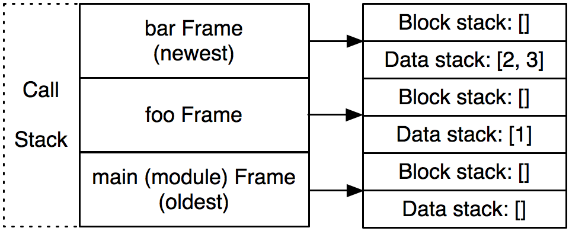

# Intro to the Python VM

The Python interpreter is a _virtual machine_ which is a _stack
machine_. It manipulates several stacks to perform its operations, as
contrasted with a _register machine_ which writes to and read from a
particular memory location.

When you write Python, the lexer, parser and compiler generate code
objects for the interpreter to operate on. The instructions in each
code object is the _bytecode_ (analogous to Assembly which is an
intermediate representation between `C` and a piece of hardware).

Python handles loops and conditionals with `GOTO` statements in the
_bytecode_.

`TOS`: Top of Stack

## Meaning of columns in bytecode
1. The line number, for the first instruction of each line
2. The current instruction, indicated as `-->`
3. A labelled instruction (jump target), indicated with `>>`
4. The address of the instruction
5. The operation code name
6. Operation parameters
7. Interpretation of the parameters in parentheses.

```python
def cond():
    x = 3
    if x < 5:
        return 'yes'
    else:
        return 'no'

op_ls = list(cond.__code__.co_code)
instructions = [
    tuple(op_list[i:i+2]) for i in range(0, len(op_list), 2)]

for instruction in instructions:
    match instruction:
        case (op, arg):
            print(f"{dis.opname[op]}\t{arg}")
        case (_,):
            print("End Program")
```
```txt
>>> dis.dis(cond)
  2         0 LOAD_CONST            1 (3)
            3 STORE_FAST            0 (x)

  3         6 LOAD_FAST             0 (x)
            9 LOAD_CONST            2 (5)
           12 COMPARE_OP            0 (<)
           15 POP_JUMP_IF_FALSE    22

  4        18 LOAD_CONST            3 ('yes')
           21 RETURN_VALUE

  6     >> 22 LOAD_CONST            4 ('no')
           25 RETURN_VALUE
           26 LOAD_CONST
           29 RETURN_VALUE
```

## Frames
A **frame** is a collection of information and context for a chunk of
code. They are created and destroyed on the fly as your Python code
executes. Each frame has one code object associated with it but a code object can have many frames. Also, each function call and class definition has a frame.

- Frames live on the _call stack_
- The _data stack_ is the one the interpreter is manipulating while it
    executes bytecode
- The _block stack_ is used for certain kinds of control flow,
    particularly looping and exception handling
- Each frame on the call stack has its own data stack and block stack



## Byterun

There are four kinds of objects in Byterun:

- `VirtualMachine`: manages the highest-level structure, particularly
    the call stack of frames. Contains a mapping of instructions to
    operations.
- `Frame`: Each of this instances has one code object and also manages
    the global and local namespaces, a reference to the calling frame
    and the last bytecode instruction executed.
- `Function`: This will be used instead of read Python functions.
    Calling a function creates a new frame in the interpreter.
- `Block`: It just wraps the three attributes of blocks.

## REFERENCES

- [A Python Interpreter Written in
    Python](http://aosabook.org/en/500L/a-python-interpreter-written-in-python.html)
